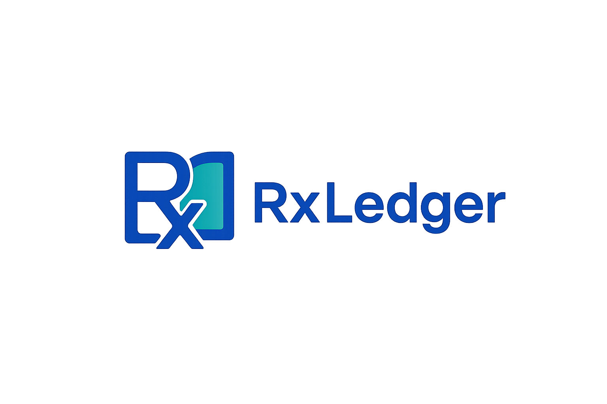

# RxLedger Branding

## Logos

### Horizontal Logo

---

### Vertical Logo

---

### Icon Only

---

## Icons and Favicons

- **favicon.ico** – Browser tab icon
- **icon-512-maskable.png** – PWA maskable icon (future)
- **logo-512-tight-crop.png** – App icons, Apple Touch Icon

---

## Social Preview

This image is used for social sharing meta tags:

---

## Color Palette

| Color        | Hex       | Usage             |
| ------------ | --------- | ----------------- |
| Primary Blue | `#2563EB` | Buttons, headings |
| Teal Accent  | `#10B981` | Highlights, links |
| Neutral Gray | `#A3B5AC` | Background        |
| Dark Text    | `#1B59AE` | Main text color   |

---

## Typography

- **Headings:** Inter SemiBold
- **Body:** Inter Regular

---

## Notes

- Do not modify logo proportions.
- Use the icon-only version for small spaces.
- Use horizontal lockup for website headers.
- Use vertical lockup for centered layouts or splash screens.
